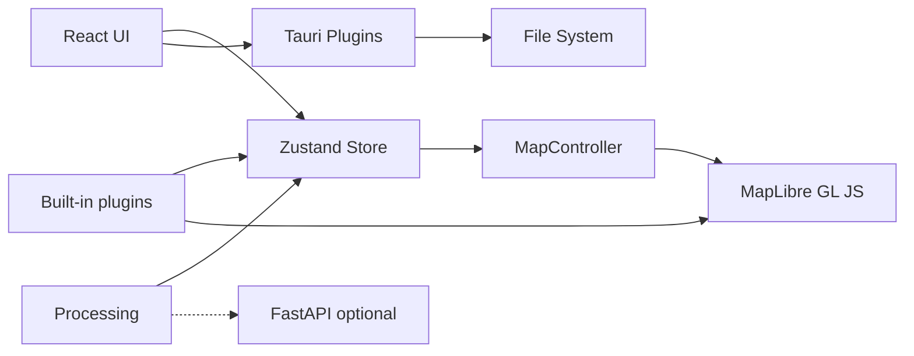

# GeoLibre Architecture

## Overview

GeoLibre is a free and open-source, lightweight, cloud-native GIS platform that runs in the web browser, on the desktop, on mobile, and inside Jupyter notebooks, all from a single npm workspaces monorepo. The UI is a React app that ships as a native desktop app hosted by Tauri v2 and as a browser-based web app, adapting responsively to mobile and small screens. Map rendering uses MapLibre GL JS in the browser webview, with deck.gl used for advanced raster, point cloud, and 3D overlays, and an optional [CesiumJS](https://cesium.com/platform/cesiumjs/) 3D-globe view (see [3D globe view (CesiumJS)](#3d-globe-view-cesiumjs)) offered as a split pane. Application state lives in a Zustand store (`@geolibre/core`).



## Packages

| Package | Responsibility |
|---------|----------------|
| `@geolibre/core` | Domain types, project JSON schema, global store |
| `@geolibre/map` | MapLibre lifecycle, layer sync, GeoJSON, raster, tile, MBTiles, control, and selection styling |
| `@geolibre/ui` | Shared UI primitives (shadcn-style) |
| `@geolibre/processing` | Client-side algorithm registry |
| `@geolibre/plugins` | Plugin interface and built-in plugins |
| `geolibre-desktop` | Shell layout, Tauri I/O, composition |

## State flow

1. User adds data through the Add Data menu, the Tauri dialog, browser file picker, drag and drop, or a built-in plugin control.
2. Local vector data is parsed directly or converted to GeoJSON with DuckDB-WASM Spatial, then passed to `addGeoJsonLayer` in the store.
3. Tile, service, raster, ArcGIS, MBTiles, and plugin-backed layers create `GeoLibreLayer` records with source metadata and native MapLibre layer ids when applicable.
4. `MapCanvas` subscribes to `layers`, then `MapController.syncLayers` updates MapLibre sources and layers and keeps the layer control in sync.
5. Style panel and layer panel updates change layer state, then map sync updates paint, visibility, opacity, ordering, and removal.
6. Attribute table selections update the highlighted feature source and can zoom the map to the selected feature.
7. Desktop save uses `projectFromStore` and writes `.geolibre.json` to disk.

## 3D globe view (CesiumJS)

The 2D MapLibre map can be joined by a 3D globe rendered with [CesiumJS](https://cesium.com/platform/cesiumjs/), offered as a **split pane** rather than a whole-app engine swap. Because the store (`@geolibre/core`) is engine-agnostic — it holds plain `GeoLibreLayer` records and a `MapViewState`, not MapLibre objects — a second renderer plugs in by subscribing to the same store, exactly as the 2D `SecondaryMapCanvas` panes do. There is no engine abstraction layer: MapLibre stays the default and the primary map, and Cesium is a first-party view mode (not a plugin — the plugin API is MapLibre-typed).

- **Enabling it.** Each secondary pane in the map grid carries a 2D/3D toggle. The globe is only offered when a Cesium Ion token is configured — Cesium World Imagery and Terrain require one — so without a token the toggle is hidden and a project saved with a globe pane opens as the 2D map. The token is resolved through `getCesiumIonToken()` (`@geolibre/core`) from a module-scoped runtime credential overlay. Desktop builds persist it in the Windows user credential store; web builds keep it in memory only until reload. It is never exposed through the public window runtime map, baked into the bundle, stored in a project, or written to browser storage. `MapGrid` re-resolves it on the non-secret `geolibre:runtime-env-change` event.
- **Lazy loading.** The whole Cesium engine (~4.8 MB) is `import()`-ed only when a pane switches to the globe, kept in its own build chunk (`manualChunks`) and off the 2D boot path. A Vite plugin (`vite-plugins/copy-cesium-assets.ts`) stages Cesium's runtime Workers/Assets/Widgets into `public/cesium/` and the canvas sets `window.CESIUM_BASE_URL` so the engine finds them.
- **Camera sync.** `packages/map/src/cesium-camera.ts` converts between MapLibre's Web-Mercator `MapViewState` (zoom, nadir-referenced pitch, bearing) and Cesium's camera (metric range, horizon-referenced pitch, heading), matched by **ground resolution** (metres per pixel) so the on-screen scale stays in step even when the panes differ in height. `CesiumCanvas` seeds its camera from the shared `mapView`, applies store changes to the globe, and writes the globe's own moves back — bidirectional, like the 2D panes — with a tolerance check that suppresses the apply→`moveEnd` echo so there is no jitter loop.
- **Layer sync.** `CesiumLayerSync` (`packages/map/src/cesium-layer-sync.ts`) reconciles the store's `GeoLibreLayer[]` onto the globe the way `MapController.syncLayers` does for MapLibre, reusing the same per-pane visibility overrides and group effects as `SecondaryMapCanvas`. It renders the kinds where Cesium is the natural fit — GeoJSON (a draped `GeoJsonDataSource` styled from the layer's fill/stroke/opacity), XYZ/raster/WMTS and WMS (as `ImageryLayer`s), and 3D Tiles (a `Cesium3DTileset` primitive that consumes the layer's tileset URL, request headers, and altitude offset directly) — with live visibility/opacity, rebuild-on-source-change, and removal. Other layer kinds (PMTiles, MBTiles, Zarr, LiDAR, splats, deck.gl viz, …) are skipped on the globe and still render in the 2D panes; the exported `isCesiumSupportedLayerType` predicate lets the pane's layer menu tag those "2D only". COG/imagery-from-raster is a candidate for a later pass.
- **Persistence.** A pane's `viewKind` is part of `SecondaryMapView` and round-trips through the `.geolibre.json` project format (`normalizeSecondaryMapViews`), so a project saved with a globe pane reopens as the globe — provided a token is available, otherwise it falls back to the 2D map.

## DuckDB-WASM

Vector file import uses DuckDB-WASM for formats that need conversion before MapLibre can render them:

```sql
INSTALL spatial;
LOAD spatial;
```

GeoParquet is read with DuckDB's Parquet reader after loading Spatial. Other local vector formats are passed to Spatial `ST_Read` when the WebAssembly extension can load the GDAL-backed reader. Zipped Shapefiles are parsed with `shpjs` first, then DuckDB Spatial is tried if that parser cannot read the file. KML files (and the KML inside unzipped KMZ archives) are read by an in-house parser that preserves embedded symbology, emitting [simplestyle-spec](https://github.com/mapbox/simplestyle-spec) properties (`fill`, `stroke`, `stroke-width`, and so on) so styled KML renders the way it does in Google Earth; KML the parser cannot handle falls back to the DuckDB Spatial reader, which loads the geometry without the styling. A vector layer whose features carry simplestyle properties is rendered per-feature: paint expressions read the per-feature color/width and fall back to the flat layer style.

## Advanced Add Data workflows

The v1.0 Add Data surface includes native dialogs for XYZ, WMS, WFS, vector files (via the Add Vector dialog backed by `maplibre-gl-vector`), GeoJSON URLs, vector tile sources, delimited text, raster tile templates, COG and GeoTIFF rasters (via the Add Raster dialog backed by `maplibre-gl-raster`), MBTiles, ArcGIS FeatureServer or VectorTileServer layers, and GPX waypoints, tracks, and routes. It also supports 3D Tiles layers, WFS and GeoJSON URL refresh, text marker labels, and multiple DuckDB SQL query-result layers with identify, selection, and attribute table support. The Components plugin wraps `maplibre-gl-components` panels for FlatGeobuf, PMTiles, Zarr, LiDAR, and Gaussian splats, then mirrors added layers into the GeoLibre store so the Layer panel, project format, and layer control can reason about them. Additional data sources are available through the Planetary Computer and Earth Engine panels, the Overture Maps plugin, and the federal Web Services plugins. The Time Slider plugin, backed by `maplibre-gl-time-slider`, animates time series raster and vector data (COG, XYZ/WMTS, WMS-Time, and time-filtered GeoJSON) through a docked timeline, mirroring each source it adds into the GeoLibre store as an external native layer.

Local MBTiles tiles are read through a custom MapLibre protocol backed by Tauri commands. Remote rasters are fetched through the desktop backend when needed, and the local development server includes a raster proxy for selected release assets that need CORS handling.

## Python sidecar

The FastAPI app in `backend/geolibre_server` backs the Whitebox toolbox and the format Conversion tools through a managed local processing sidecar. The desktop app starts the sidecar on demand, communicates over `127.0.0.1`, and keeps the heavier Python processing stack outside the browser bundle.

The Vector tools (Processing → Vector) run client-side with Turf.js and need no sidecar. All of the tools can optionally run on the sidecar's `/vector` endpoints, backed by GeoPandas and Shapely, for projection-aware results; the sidecar reports availability through `/vector/status`, and the dialog falls back to the client engine when the optional `vector` extra is not installed.

A third Vector engine, **Python (Pyodide)**, runs the same GeoPandas/Shapely code **in the browser** via [Pyodide](https://pyodide.org) (CPython compiled to WebAssembly), so the GeoPandas path is available on the web build with no server. The geometry logic is a framework-free module, `backend/geolibre_server/geolibre_server/vector_ops.py`, that both the sidecar and the browser run — a Vite plugin (`vite-plugins/copy-vector-ops.ts`) copies it into the app bundle, and a classic Web Worker (`public/pyodide/pyodide-worker.js`) loads Pyodide from a CDN, installs `geopandas`, and calls `run_vector_tool` over a JSON-string boundary. One source of truth means the Sidecar and Pyodide engines return identical results. The Pyodide runtime is downloaded lazily on first use; the `VITE_PYODIDE_INDEX_URL` env var points it at a self-hosted mirror for offline/production deployments.

The **SQL Workspace** offers an **Apache Sedona** engine alongside DuckDB and PostGIS. It runs Sedona spatial SQL on [SedonaDB](https://sedona.apache.org/sedonadb/), the single-node Rust (DataFusion + Arrow) engine, through the sidecar's `/sql` endpoints (`/sql/status`, `/sql/run`) backed by the optional `sedona` extra (`apache-sedona[db]`). In the browser — and on desktop when the extra is not installed — the same engine runs entirely client-side on [CereusDB](https://github.com/tobilg/cereusdb), a WebAssembly build of SedonaDB; the workspace prefers the sidecar when reachable and falls back to CereusDB automatically. The CereusDB bundle is large, so it is dynamically imported into its own chunk and only downloaded when a Sedona query first runs.

Future processing releases are expected to expand the same sidecar pattern for GDAL, Rasterio, Leafmap, GeoAI, and SamGeo workflows.

## Offline support (PWA)

The standalone web build is an installable Progressive Web App. `vite-plugin-pwa` (configured in `apps/geolibre-desktop/vite.config.ts`) emits a web manifest plus a Workbox service worker, and `src/main.tsx` registers it next to `installStaleChunkReload` so the two coordinate. The service worker is built only for the web build; it is disabled for the Tauri desktop build (already offline via bundled assets) and the embedded Jupyter wheel (`GEOLIBRE_EMBED=1`), where `registerSW` resolves to a no-op.

Caching is split to keep the first visit light:

- **Precache (app shell).** The HTML and the JS/CSS chunks that boot the map are precached, so the shell loads with no network after the first visit. The heavy chunks below are excluded from the precache to avoid a large first-load download.
- **Runtime cache, CacheFirst.** The content-hashed build assets the precache skips (everything under `/assets/`) are cached on first use: the **MapLibre** bundle, **DuckDB-WASM and its spatial extension**, and the MapLibre feature-plugin chunks. Hashed filenames make CacheFirst safe — a redeploy mints new URLs, so a stale entry is never served as current. This is what makes local-file workflows (DuckDB Spatial conversion) work offline after they have run online once. Self-hosting the spatial extension via `VITE_DUCKDB_SPATIAL_EXTENSION_PATH` keeps it same-origin so it is cached too. **PGlite/PostGIS** is **not** in this list: it is fetched from the jsDelivr CDN (cross-origin) to keep it out of the build — ~25 MB raw, and ~22 MB of otherwise-incompressible weight in the Tauri binary — so the PostGIS SQL engine needs network on first use (see the Pyodide note below).
- **Basemaps.** Tiles and styles from the CORS-friendly default hosts (OpenFreeMap, CARTO) are runtime-cached. Other remote tiles, services, and ArcGIS/WMS/WFS sources stay network-only by design and are unavailable offline.

The **Pyodide** vector engine and the **PGlite/PostGIS** SQL engine are **not** offline-capable in the default configuration: both are loaded from the jsDelivr CDN (cross-origin), which the service worker does not cache. Point `VITE_PYODIDE_INDEX_URL` at a same-origin mirror to make Pyodide cacheable for offline use; build with `GEOLIBRE_PGLITE_CDN=0` to vendor PGlite/PostGIS back into the build (this re-adds ~22 MB to the Tauri binary). The same CDN dependency applies to the desktop build — it loads both from jsDelivr too.

A new deploy is picked up via `registerType: "autoUpdate"`: the new service worker installs in the background and takes control (`skipWaiting` + `clientsClaim`), so its fresh precache serves subsequent requests. Workbox's default force-reload-on-activation is deliberately suppressed via `onNeedReload` in `src/main.tsx` — on the relative-base `/demo/` subpath that reload fired spuriously and discarded in-progress map state. Page recovery is delegated to `installStaleChunkReload`, which reloads on-demand only when an orphaned lazy chunk 404s (cooldown-guarded; if `sessionStorage` is blocked it skips the reload and lets the preload error surface). Precached chunks are served from cache and never 404, so the page is no longer reloaded out from under the user.

## Container image

The root Dockerfile packages the browser version of the app. It uses a Node build stage to run the workspace build for `geolibre-desktop`, then copies `apps/geolibre-desktop/dist` into an nginx runtime image. The nginx config serves static assets and falls back to `index.html` for browser-entry URLs.

The `Publish Container Image` GitHub Actions workflow builds the image for pull requests and publishes it to GitHub Container Registry for pushes to `main`, version tags, and manual runs. The upstream image name is `ghcr.io/opengeos/geolibre`.

The container does not run the Tauri desktop shell or the optional Python sidecar. Workflows that depend on desktop filesystem access still require the installed desktop app.

## Security

- Tauri CSP allowlists tile and style hosts (OpenFreeMap, CARTO).
- File access uses dialog-selected paths only.

### Native HTTP trust store and mutual TLS

The desktop app issues some remote fetches (tile/URL resolution, OGC
GetCapabilities, and similar) from the native Rust process rather than the
WebView. That path (`guarded_http_client` in `src-tauri/src/lib.rs`) trusts the
**OS/system certificate store** in addition to the bundled Mozilla roots, so a
server signed by an enterprise CA installed on the machine is accepted without
extra configuration.

For endpoints behind **mutual TLS (mTLS)**, the WebView `fetch` path shows an
interactive OS certificate prompt; the native Rust client cannot, so point it at
a client certificate with environment variables:

| Variable | Purpose |
| --- | --- |
| `GEOLIBRE_HTTP_CA_CERT` | Path to a PEM bundle of extra CA certificate(s) to trust, on top of the OS store (for a private CA not installed system-wide). |
| `GEOLIBRE_HTTP_CLIENT_CERT` | Path to the client certificate to present. A `.pem` file (certificate chain plus an **unencrypted** PKCS#8 private key) or a PKCS#12 bundle (`.p12`/`.pfx`). |
| `GEOLIBRE_HTTP_CLIENT_CERT_PASSWORD` | Passphrase for a PKCS#12 client certificate. Its presence also forces the PKCS#12 code path. |

A `.p12`/`.pfx` extension (or a supplied passphrase) selects PKCS#12; any other
path is read as PEM. PEM identities use the default rustls backend; PKCS#12
identities use the platform native-tls backend (SChannel on Windows, Secure
Transport on macOS, OpenSSL on Linux), which also reads the OS trust store.
Convert a PKCS#12 export to PEM with
`openssl pkcs12 -in cert.p12 -out cert.pem -nodes` if you prefer the rustls path.
A set-but-empty value for any of these variables is treated as unset.

The configured client certificate is held on the shared native HTTP client and
is therefore **presented to any HTTPS server that requests one** during a native
fetch (tile, style, and OGC hosts a project points at), not only the endpoint the
certificate was issued for. TLS sends a client certificate only when the server
asks for one, so this is not an unconditional disclosure, but configure a client
certificate only when the hosts the app talks to are trusted.

## Performance: map rendering on Linux (WebKitGTK)

The desktop app uses the system WebView. On Linux that is **WebKitGTK**, whose
WebGL/JavaScript pipeline is materially slower than the Chromium engine the
browser build runs in. The most visible effect is **map panning at low zoom**:

- A blank map (no tile layer) pans at a steady 60 FPS at any zoom.
- With any tile layer (vector **or** raster XYZ), FPS collapses to single
  digits **while tiles are loading**, then snaps back to 60 once loading stops,
  at the same zoom. Low zoom only makes it constant because panning across the
  whole world loads tiles continuously and the cache never settles.

The cost is WebKitGTK processing each newly-loaded tile on the main thread: the
GPU upload of its texture (raster) or vertex buffers (vector) via synchronous
WebGL calls, plus the subsequent fade-in repaint frames. Vector tile parsing and
bucket building run in MapLibre's Web Workers, so they are not the bottleneck
here. Each tile-integration render cycle measured ~125 ms wall-clock in
WebKitGTK versus a few ms in Chromium. The gap is in WebKitGTK's WebGL
implementation and compositor pipeline (driver command-stream flush, TextureMapper
GL surface composition), not solely its JavaScriptCore JS engine. This is a
WebView-engine limitation, not a bug in GeoLibre, and it does not affect the
browser build or (untested) the macOS/Windows WebViews.

Ruled out during diagnosis (so future investigation does not repeat them):
software rendering (the GPU is used, Intel i915 confirmed), GPU saturation (the
render engine stays ~20% idle), the Tauri IPC file read (~126 ms for a 22 MB
GeoJSON), `JSON.parse` (~36 ms), KWin compositor latency, `renderWorldCopies`,
the globe vs. mercator projection, and `preserveDrawingBuffer`.

To reproduce the measurement: temporarily log MapLibre `render` events,
`dataloading` (tile) events, and a `requestAnimationFrame` counter once per
second; FPS tracks tile-load count inversely. The quickest check is this
frame-rate meter pasted into the WebView devtools console, then pan while
watching the logged FPS:

```js
let f=0,t=performance.now();(function loop(n){f++;if(n-t>=1000){console.log('FPS',f);f=0;t=n;}requestAnimationFrame(loop);})(t);
```

Mitigations (reduce *how many* tiles load during a pan, since per-tile cost is
fixed by the engine) are not yet implemented: a larger `maxTileCacheSize`,
512px raster tiles instead of 256px, and `fadeDuration: 0`, ideally gated to
WebKitGTK so the Chromium-based builds keep full fidelity.
