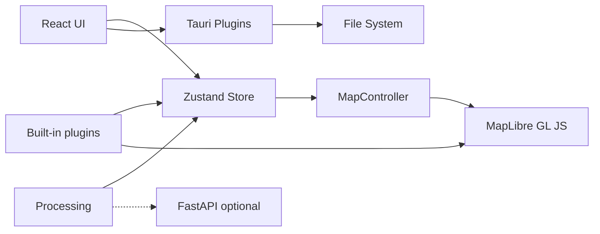

# GeoLibre Architecture

## Overview

GeoLibre is a lightweight, cloud-native GIS platform that runs across desktop and web environments, with a responsive layout for mobile screens, all from a single npm workspaces monorepo. The UI is a React app that ships as a native desktop app hosted by Tauri v2 and as a browser-based web app, adapting responsively to mobile and small screens. Map rendering uses MapLibre GL JS in the browser webview, with deck.gl used for advanced raster, point cloud, and 3D overlays. Application state lives in a Zustand store (`@geolibre/core`).



## Packages

| Package | Responsibility |
|---------|----------------|
| `@geolibre/core` | Domain types, project JSON schema, global store |
| `@geolibre/map` | MapLibre lifecycle, layer sync, GeoJSON, raster, tile, MBTiles, control, and selection styling |
| `@geolibre/ui` | Shared UI primitives (shadcn-style) |
| `@geolibre/processing` | Client-side algorithm registry |
| `@geolibre/plugins` | Plugin interface and built-in plugins |
| `geolibre-desktop` | Shell layout, Tauri I/O, composition |

## State flow

1. User adds data through the Add Data menu, the Tauri dialog, browser file picker, drag and drop, or a built-in plugin control.
2. Local vector data is parsed directly or converted to GeoJSON with DuckDB-WASM Spatial, then passed to `addGeoJsonLayer` in the store.
3. Tile, service, raster, ArcGIS, MBTiles, and plugin-backed layers create `GeoLibreLayer` records with source metadata and native MapLibre layer ids when applicable.
4. `MapCanvas` subscribes to `layers`, then `MapController.syncLayers` updates MapLibre sources and layers and keeps the layer control in sync.
5. Style panel and layer panel updates change layer state, then map sync updates paint, visibility, opacity, ordering, and removal.
6. Attribute table selections update the highlighted feature source and can zoom the map to the selected feature.
7. Desktop save uses `projectFromStore` and writes `.geolibre.json` to disk.

## DuckDB-WASM

Vector file import uses DuckDB-WASM for formats that need conversion before MapLibre can render them:

```sql
INSTALL spatial;
LOAD spatial;
```

GeoParquet is read with DuckDB's Parquet reader after loading Spatial. Other local vector formats are passed to Spatial `ST_Read` when the WebAssembly extension can load the GDAL-backed reader. Zipped Shapefiles are parsed with `shpjs` first, then DuckDB Spatial is tried if that parser cannot read the file. KMZ archives are unzipped in the browser and their KML files are passed through the same DuckDB Spatial KML reader.

## Advanced Add Data workflows

The v1.0 Add Data surface includes native dialogs for XYZ, WMS, WFS, vector files (via the Add Vector dialog backed by `maplibre-gl-vector`), GeoJSON URLs, vector tile sources, delimited text, raster tile templates, COG and GeoTIFF rasters (via the Add Raster dialog backed by `maplibre-gl-raster`), MBTiles, ArcGIS FeatureServer or VectorTileServer layers, and GPX waypoints, tracks, and routes. It also supports 3D Tiles layers, WFS and GeoJSON URL refresh, text marker labels, and multiple DuckDB SQL query-result layers with identify, selection, and attribute table support. The Components plugin wraps `maplibre-gl-components` panels for FlatGeobuf, PMTiles, Zarr, LiDAR, and Gaussian splats, then mirrors added layers into the GeoLibre store so the Layer panel, project format, and layer control can reason about them. Additional data sources are available through the Planetary Computer and Earth Engine panels, the Overture Maps plugin, and the federal Web Services plugins. The Time Slider plugin, backed by `maplibre-gl-time-slider`, animates time series raster and vector data (COG, XYZ/WMTS, WMS-Time, and time-filtered GeoJSON) through a docked timeline, mirroring each source it adds into the GeoLibre store as an external native layer.

Local MBTiles tiles are read through a custom MapLibre protocol backed by Tauri commands. Remote rasters are fetched through the desktop backend when needed, and the local development server includes a raster proxy for selected release assets that need CORS handling.

## Python sidecar

The FastAPI app in `backend/geolibre_server` backs the Whitebox toolbox and the format Conversion tools through a managed local processing sidecar. The desktop app starts the sidecar on demand, communicates over `127.0.0.1`, and keeps the heavier Python processing stack outside the browser bundle.

The Vector tools (Processing → Vector) run client-side with Turf.js and need no sidecar. All of the tools can optionally run on the sidecar's `/vector` endpoints, backed by GeoPandas and Shapely, for projection-aware results; the sidecar reports availability through `/vector/status`, and the dialog falls back to the client engine when the optional `vector` extra is not installed.

A third Vector engine, **Python (Pyodide)**, runs the same GeoPandas/Shapely code **in the browser** via [Pyodide](https://pyodide.org) (CPython compiled to WebAssembly), so the GeoPandas path is available on the web build with no server. The geometry logic is a framework-free module, `backend/geolibre_server/geolibre_server/vector_ops.py`, that both the sidecar and the browser run — a Vite plugin (`vite-plugins/copy-vector-ops.ts`) copies it into the app bundle, and a classic Web Worker (`public/pyodide/pyodide-worker.js`) loads Pyodide from a CDN, installs `geopandas`, and calls `run_vector_tool` over a JSON-string boundary. One source of truth means the Sidecar and Pyodide engines return identical results. The Pyodide runtime is downloaded lazily on first use; the `VITE_PYODIDE_INDEX_URL` env var points it at a self-hosted mirror for offline/production deployments.

Future processing releases are expected to expand the same sidecar pattern for GDAL, Rasterio, DuckDB Spatial SQL, Leafmap, GeoAI, and SamGeo workflows.

## Offline support (PWA)

The standalone web build is an installable Progressive Web App. `vite-plugin-pwa` (configured in `apps/geolibre-desktop/vite.config.ts`) emits a web manifest plus a Workbox service worker, and `src/main.tsx` registers it next to `installStaleChunkReload` so the two coordinate. The service worker is built only for the web build; it is disabled for the Tauri desktop build (already offline via bundled assets) and the embedded Jupyter wheel (`GEOLIBRE_PGLITE_CDN=1`), where `registerSW` resolves to a no-op.

Caching is split to keep the first visit light:

- **Precache (app shell).** The HTML and the JS/CSS chunks that boot the map are precached, so the shell loads with no network after the first visit. The heavy chunks below are excluded from the precache to avoid a large first-load download.
- **Runtime cache, CacheFirst.** The content-hashed build assets the precache skips (everything under `/assets/`) are cached on first use: the **MapLibre** bundle, **DuckDB-WASM and its spatial extension**, **PGlite/PostGIS**, and the MapLibre feature-plugin chunks. Hashed filenames make CacheFirst safe — a redeploy mints new URLs, so a stale entry is never served as current. This is what makes local-file workflows (DuckDB Spatial conversion, the PGlite/PostGIS engine) work offline after they have run online once. Self-hosting the spatial extension via `VITE_DUCKDB_SPATIAL_EXTENSION_PATH` keeps it same-origin so it is cached too.
- **Basemaps.** Tiles and styles from the CORS-friendly default hosts (OpenFreeMap, CARTO) are runtime-cached. Other remote tiles, services, and ArcGIS/WMS/WFS sources stay network-only by design and are unavailable offline.

The **Pyodide** vector engine is **not** offline-capable in the default configuration: its runtime is loaded from the jsDelivr CDN (cross-origin), which the service worker does not cache. Point `VITE_PYODIDE_INDEX_URL` at a same-origin mirror to make it cacheable for offline use.

A new deploy is picked up via `registerType: "autoUpdate"`: the new service worker installs in the background, then reloads the page to re-evaluate the current build's import graph. That is the same recovery `installStaleChunkReload` performs for orphaned lazy chunks, so the service worker does not regress it — precached chunks are served from cache and never 404, and the stale-chunk reload remains the fallback for any chunk not in the precache.

## Container image

The root Dockerfile packages the browser version of the app. It uses a Node build stage to run the workspace build for `geolibre-desktop`, then copies `apps/geolibre-desktop/dist` into an nginx runtime image. The nginx config serves static assets and falls back to `index.html` for browser-entry URLs.

The `Publish Container Image` GitHub Actions workflow builds the image for pull requests and publishes it to GitHub Container Registry for pushes to `main`, version tags, and manual runs. The upstream image name is `ghcr.io/opengeos/geolibre`.

The container does not run the Tauri desktop shell or the optional Python sidecar. Workflows that depend on desktop filesystem access still require the installed desktop app.

## Security

- Tauri CSP allowlists tile and style hosts (OpenFreeMap, CARTO).
- File access uses dialog-selected paths only.
